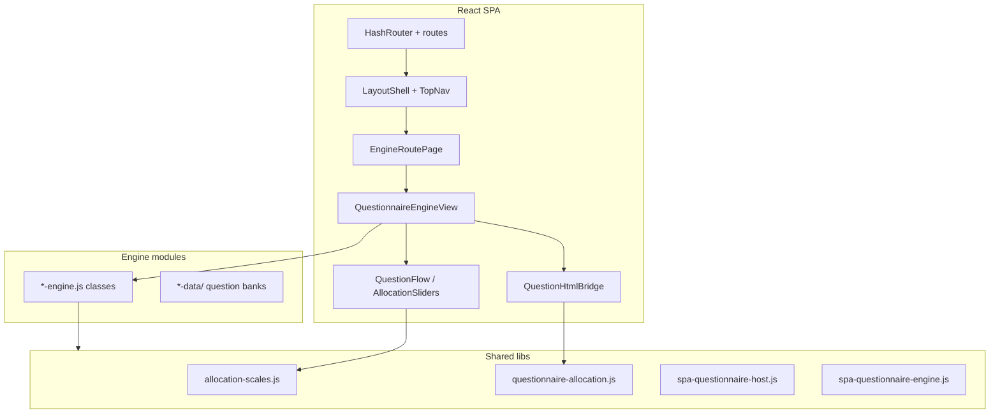
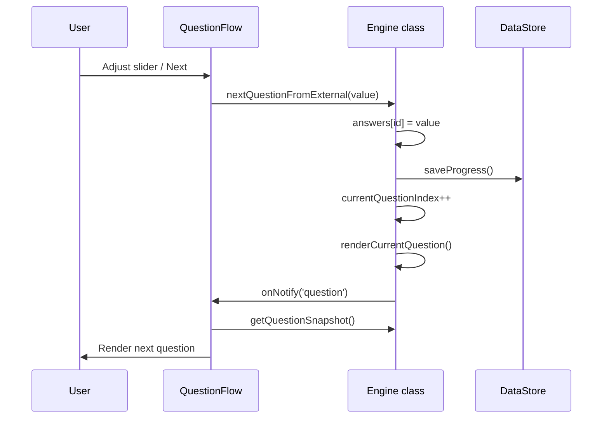
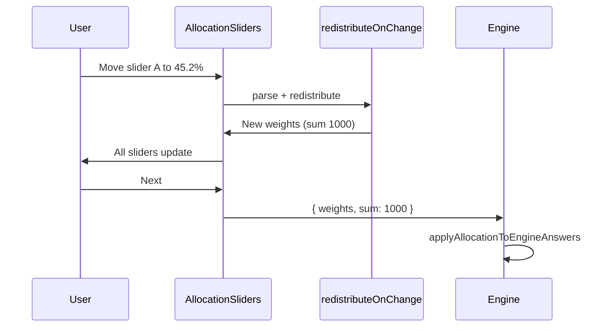

# V3 SPA + Assessment Architecture — Replication Guide

This document describes a **reference architecture** for a static-hosted React SPA with multi-phase assessment engines, unified visual design, and coupled allocation sliders. It is written so another agent or team can **replicate the structure, UI, aesthetics, and assessment patterns** in a different project with different product names and content.

The reference implementation lives in a monorepo layout: a Vite React app under `v3/spa/`, shared libraries under `shared/`, and assessment logic in root-level `*-engine.js` modules loaded at runtime.

---

## Table of contents

1. [High-level architecture](#1-high-level-architecture)
2. [Repository layout](#2-repository-layout)
3. [Build and deployment](#3-build-and-deployment)
4. [Routing and pages](#4-routing-and-pages)
5. [Design system (tokens, themes, typography)](#5-design-system-tokens-themes-typography)
6. [CSS architecture and class naming](#6-css-architecture-and-class-naming)
7. [Site shell layout](#7-site-shell-layout)
8. [Assessment engine pattern](#8-assessment-engine-pattern)
9. [SPA host contract (`externalUI`)](#9-spa-host-contract-externalui)
10. [Question types and answer shapes](#10-question-types-and-answer-shapes)
11. [Allocation sliders — UX and balancing mathematics](#11-allocation-sliders-coupled-100-ux)
12. [React assessment UI kit](#12-react-assessment-ui-kit)
13. [Progress persistence](#13-progress-persistence)
14. [End-to-end flows (diagrams)](#14-end-to-end-flows-diagrams)
15. [Replication checklist](#15-replication-checklist)
16. [Reference file map](#16-reference-file-map)

---

## 1. High-level architecture

Three cooperating layers:

| Layer | Responsibility | Typical location |
|--------|----------------|------------------|
| **Marketing SPA** | Routes, theme, nav, tool catalog, engine chrome | `v3/spa/src/` |
| **Shared libraries** | Allocation math, questionnaire host API, storage, themes bridge | `shared/` |
| **Assessment engines** | Phases, `questionSequence`, scoring, progress save | `*-engine.js` at repo root |

**Key design choice:** engines are **not** fully ported to React. The SPA hosts them via `externalUI: true` and either:

- **React-native questions** — snapshots drive `QuestionFlow` / `AllocationSliders`
- **DOM bridge** — engine renders HTML into a mount point (`QuestionHtmlBridge`)
- **Full DOM shell** — engine owns the entire assessment body (forms, multi-step wizards)



---

## 2. Repository layout

```
project-root/
├── v3/
│   ├── vite.config.js          # Vite: root = v3/spa, base path, aliases
│   └── spa/
│       ├── index.html          # Dev entry (fonts, #root)
│       └── src/
│           ├── main.jsx        # Bootstrap: CSS imports, HashRouter
│           ├── App.jsx         # Route table inside LayoutShell
│           ├── routes.js       # navItems, engineRoutes, lazy view map
│           ├── components/     # LayoutShell, TopNav, SeoHead, marketing widgets
│           ├── pages/          # Home, Tools hub, Books, About, EngineRoutePage
│           ├── engines/        # Per-engine React views + shared/ kit
│           ├── data/           # Catalog copy, SEO meta, static page content
│           ├── lib/            # themeStore
│           └── styles/
│               ├── tokens.css
│               ├── global.css
│               └── engine-assessment.css
├── shared/                     # Cross-engine helpers (importable from engines + SPA)
├── *-engine.js                 # One class per assessment tool
├── *-data/                     # Static question/scoring data
├── index.html                  # Production SPA shell (built output)
└── assets/                     # Hashed JS/CSS bundles from Vite build
```

**Alias convention (Vite):**

| Alias | Points to | Used for |
|-------|-----------|----------|
| `@` | `v3/spa/src` | React components, styles |
| `@site` | Repository root | Dynamic `import('@site/some-engine.js')` |

---

## 3. Build and deployment

**Toolchain:** Vite 8 + `@vitejs/plugin-react` + React 19.

**`vite.config.js` essentials:**

```javascript
export default defineConfig({
  root: "v3/spa",
  base: "/site/",                    // static hosting subpath
  resolve: {
    alias: {
      "@": "./spa/src",
      "@site": repoRoot,             // parent of v3/
    },
  },
  server: { fs: { allow: [repoRoot] } },
  build: {
    outDir: repoRoot,                // emit index.html + assets/ at site root
    emptyOutDir: false,              // preserve images, archives, etc.
  },
});
```

**Why `HashRouter`:** GitHub Pages (or any static host) has no server rewrite rules. Routes are `#/`, `#/tools`, `#/engines/:engineId`.

**Production URL shape:** `https://example.com/site/#/engines/my-engine`

**npm scripts pattern:**

- `v3:dev` — local dev server
- `v3:build` — production bundle into site root
- `v3:preview` — preview built assets

---

## 4. Routing and pages

### Route table (`App.jsx`)

All routes nest under `LayoutShell` (provides nav + outlet):

| Hash path | Page role |
|-----------|-----------|
| `/` | Home — hero, tool grid, engagement widgets |
| `/tools` | Tools hub — categorized list linking to engines |
| `/books` | Long-form content sections |
| `/about` | Author / project info |
| `/testimonials` | Optional lazy-loaded testimonials |
| `/engines/:engineId` | Assessment host |
| `*` | Redirect to `/` |

### Engine routing (`EngineRoutePage.jsx`)

1. Resolve `engineId` from `engineRoutes` registry
2. If a **native React view** exists → `React.lazy` + `Suspense`
3. Else → generic adapter placeholder (should not occur if all engines registered)

### Engine registry (`routes.js`)

Each engine entry:

```javascript
{
  id: "my-engine",           // URL param
  path: "/engines/my-engine",
  label: "Display name",
  legacyPage: "/site/archive/...",  // optional archived HTML
}
```

`nativeEngineViews` maps `id` → `lazy(() => import('./engines/my-engine/MyEngineView.jsx'))`.

### Two-stage code splitting

1. **React view chunk** — loaded when user navigates to `/engines/:id`
2. **Engine JS module** — loaded inside `useEngineHost` on first mount via `engineModules.js`

---

## 5. Design system (tokens, themes, typography)

### CSS load order (`main.jsx`)

1. `styles/tokens.css` — spacing, fonts, per-theme colors, legacy bridge variables
2. `styles/global.css` — shell, marketing pages, buttons
3. `styles/engine-assessment.css` — assessment UI under `.bm-engine-content`

### Fonts

Loaded in `spa/index.html` (Google Fonts):

- **Display / headings:** Fraunces (serif)
- **Body:** Source Sans 3 (sans-serif)

```css
--v3-font-display: "Fraunces", "Georgia", serif;
--v3-font-body: "Source Sans 3", "Segoe UI", system-ui, sans-serif;
```

### Spacing scale (`tokens.css`)

| Token | Value |
|-------|--------|
| `--v3-space-1` | 0.5rem |
| `--v3-space-2` | 0.75rem |
| `--v3-space-3` | 1rem |
| `--v3-space-4` | 1.5rem |
| `--v3-space-5` | 2rem |
| `--v3-radius` | 14px |

### Theme system

Themes are **CSS classes on `<html>`**: `theme-earth`, `theme-cosmic`, `theme-light`, `theme-forge`, `theme-neomorphism`.

`LayoutShell` syncs class on `document.documentElement` from `themeStore.js` (localStorage key e.g. `bm_site_theme`).

Each theme defines:

| Variable group | Purpose |
|----------------|---------|
| `--v3-bg`, `--v3-bg-glow`, `--v3-bg-soft` | Page background layers |
| `--v3-surface`, `--v3-surface-border`, `--v3-nav-bg` | Cards, nav |
| `--v3-text`, `--v3-heading`, `--v3-muted` | Typography colors |
| `--v3-accent`, `--v3-accent-strong`, `--v3-on-accent` | CTAs, progress fills |
| `--v3-backdrop-art-filter`, `--v3-backdrop-art-opacity` | Full-bleed background image tuning (desktop) |

**Legacy bridge:** each theme also sets `--brand`, `--glass`, `--accent`, `--border-*`, `--shadow-*`, `--question-hint-bg`, etc., so older engine HTML and new React components share one palette.

### Visual principles

1. **Layered backgrounds** — radial glow + gradient on `.app`; optional fixed full-bleed art (`::before`) on desktop only (`min-width: 1024px`)
2. **Glass-like surfaces** — semi-transparent `--v3-surface` cards with subtle borders
3. **Accent-forward interaction** — gradient primary buttons, glowing progress bars, left-border accent panels
4. **Readable width** — engine questions max ~`52rem`; marketing container ~`1120px`
5. **Touch targets** — engine buttons min-height ~44px
6. **Reduced motion** — respect `prefers-reduced-motion` where transitions exist

---

## 6. CSS architecture and class naming

### Prefix conventions

| Prefix | Scope | Example |
|--------|--------|---------|
| `v3-*` | Site shell, marketing | `v3-btn--primary`, `v3-hero-title`, `v3-section-band--gradient` |
| `bm-*` | Assessment / engine UI (BEM) | `bm-question-flow`, `bm-progress__fill`, `bm-selection-card--selected` |
| Unprefixed layout | Shared primitives | `.app`, `.container`, `.stack`, `.surface`, `.grid` |

### Button system (`global.css`)

| Class | Use |
|-------|-----|
| `.v3-btn` | Base: inline-flex, rounded, accent-tinted border |
| `.v3-btn--primary` | Gradient fill, light text on accent |
| `.v3-btn--outline` | Transparent + accent border |
| `.v3-btn--ghost` | Minimal, soft heading color |
| `.v3-btn--soft` | Light accent tint background |
| `.v3-btn--secondary` | Surface blend |

Inside `.bm-engine-content`, legacy `.btn`, `.btn-primary`, `.next-btn` mirror the same intent using `--accent` / `--glass`.

### Assessment-specific classes (`engine-assessment.css`)

**Scoped under `.bm-engine-content`** so marketing chrome never inherits engine-only rules.

| Component | Classes |
|-----------|---------|
| Engine card | `.bm-engine-content` |
| Question flow | `.bm-question-flow` (max-width ~52rem, centered) |
| Progress | `.bm-progress`, `.bm-progress__fill`, `.bm-progress__text` |
| Likert / scale | `.bm-scale`, `.bm-scale__value` |
| Hints | `.bm-question-hint` (left accent bar + tinted background) |
| Stem / badge | `.bm-question-stem`, `.bm-question-badge`, `.bm-question-clinical` |
| Navigation | `.bm-question-nav`, `.bm-abandon` |
| Allocation | `.bm-allocation-flow`, `.bm-allocation-grid`, `.bm-allocation-row`, `.bm-allocation-sum`, `.bm-allocation-sum--ok` |
| Idle selection | `.bm-selection-grid`, `.bm-selection-card`, `.bm-selection-card--selected`, `.bm-selection-card--suggested` |
| Results / export | `.bm-results-bridge`, `.bm-export-actions` |

Legacy class names (`.progress-bar`, `.scenario-option`, `.likert-option`, etc.) are styled in the **same file** so DOM-rendered and React-rendered UIs match.

---

## 7. Site shell layout

### `LayoutShell.jsx`

```
.app
├── SeoHead (title, OG tags from route meta)
├── TopNav (brand, nav links, theme <select>)
└── main.container
    └── <Outlet />  (page content)
```

### `TopNav`

- Sticky, blurred background (`--v3-nav-bg`)
- `NavLink` items from `routes.js` → `navItems`
- Theme picker calls `onThemeChange` → persists to localStorage

### `EngineLayout.jsx` (per-tool chrome)

```
section.stack.bm-engine
├── article.surface (intro)
│   ├── p.kicker          ("Tool")
│   ├── h1.v3-hero-title  (tool label)
│   ├── p.v3-muted        (lead copy)
│   └── disclaimer link
└── div.bm-engine-content
    └── {assessment body}
```

### Marketing page patterns

- **Hero:** `v3-hero-title`, `v3-lead`, optional `v3-hero-actions` with `v3-btn`
- **Sections:** `.surface` cards, `.v3-section-title`, optional `.v3-section-band--gradient`
- **Tool rows:** `.v3-tool-row` grid `96px | 1fr | auto` (stacks on mobile)
- **Grids:** `.grid` with `minmax(230px, 1fr)` or catalog-specific grids

---

## 8. Assessment engine pattern

### Engine class responsibilities

Each `*-engine.js` exports a class (e.g. `MyEngine`) with:

| State / field | Role |
|---------------|------|
| `currentPhase` / `currentStage` | `'idle' \| 'assessment' \| 'results'` (or custom substates) |
| `currentQuestionIndex` | Index into active `questionSequence` |
| `questionSequence[]` | Flat queue for **current** phase (rebuilt on phase change) |
| `answers{}` | Map `questionId → answer` (shape varies by type) |
| `analysisData` / score objects | Accumulated scoring |
| `dataStore` | Namespaced persistence (`DataStore` utility) |

### Phase lifecycle

1. **Idle** — optional section/category selection (`getSelectionModel`, `toggleSelection`)
2. **Assessment** — walk `questionSequence`; render question; save answer; advance index
3. **Results** — compute report; render HTML or emit `results` event

Phase transitions:

- `buildPhaseNSequence()` — filter/sample questions, optionally `mapQuestionsForAllocation()`, assign `questionSequence`, reset index
- On last question → `completePhase()` → analysis → next phase or `completeAssessment()`

### Question rendering (dual path)

```javascript
renderCurrentQuestion() {
  const question = this.questionSequence[this.currentQuestionIndex];
  if (this.externalUI && externalRenderQuestion(this, question)) {
    return; // snapshot emitted; React draws UI
  }
  // else: innerHTML into #questionContainer + attach listeners
}
```

### Legacy vs SPA boot

Engines must **not** auto-start when bundled into the SPA. Gate module-level initialization:

```javascript
if (document.body.dataset.bmLegacyPage === 'true') {
  // only on archived standalone HTML pages
  bootEngine();
}
```

---

## 9. SPA host contract (`externalUI`)

### Constructor

```javascript
new EngineClass({
  externalUI: true,
  onNotify: (event, payload) => { /* update React state */ },
});
```

When `externalUI` is true:

- Skip `EngineUIController` DOM show/hide
- Skip most legacy `attachEventListeners`
- Emit events at phase/question boundaries

### Events

| Event | When | React action |
|-------|------|----------------|
| `init` | After `init()` / data load | Sync phase from `getPhase()` |
| `phase` | Phase change | `setPhase(payload.phase)` |
| `selection` | Idle selection toggled | Bump tick / refresh selection grid |
| `question` | Question ready | Read `getQuestionSnapshot()` |
| `refinement-offer` | Optional sub-flow | Custom UI (e.g. comorbidity) |
| `results` | Report ready | Show `ResultsHtmlBridge` |

### Required host API (questionnaire engines)

| Method | Purpose |
|--------|---------|
| `getPhase()` | Current phase string |
| `getQuestionSnapshot()` | `{ question, currentIndex, totalQuestions }` |
| `getSelectionModel()` | Idle cards (optional) |
| `toggleSelectionFromExternal(id)` | Toggle idle selection |
| `startAssessment()` | Begin questionnaire |
| `nextQuestionFromExternal(value)` | Advance with answer |
| `prevQuestionFromExternal(value)` | Go back |
| `setExternalQuestionMount(el)` | DOM mount for legacy questions |
| `setExternalResultsMount(el)` | DOM mount for results HTML |
| `hydrateResultsView()` / `showResults()` | Render results |
| `resetAssessment()` | Return to idle |
| `usesDomQuestions()` | `true` if current question is not React-native |
| `destroy()` | Cleanup on unmount |

Attached by `shared/spa-questionnaire-host.js` via `attachDomQuestionSpaApi` or custom methods on the prototype.

### `useEngineHost` hook (React)

1. Dynamic import `engineLoaders[engineId]`
2. Resolve class from `engineClassNames` map or `default` export
3. `new EngineClass({ externalUI: true, onNotify })`
4. Await `instance.ready`
5. On unmount: `setExternalQuestionMount(null)`, `destroy()`

---

## 10. Question types and answer shapes

### Canonical answer shapes

| Type | Stored answer | Notes |
|------|---------------|--------|
| `scaled` / `likert` | `number` | Often 0–10 or 1–7; `sliderStep` on question |
| `allocation` | `{ ids, weights, sum, version }` | Weights in **tenths** (see §11) |
| `multiselect` | `string[]` or option objects | May be converted to allocation for prioritization UX |
| `scenario` | Option id/object | Often converted to allocation |
| `ranked` | `{ order: string[] }` | |
| Engine-specific | Varies | frequency grids, binary, three_point, forms |

### Snapshot shape (React)

Built by `buildQuestionSnapshot(engine, question)` in `spa-questionnaire-engine.js`:

**Allocation:**

```javascript
{
  question: {
    id, type: 'allocation', text, plainHint, badge,
    allocationMembers: [{ id, label, hint }],
    allocationWeights: { [id]: number },
    allocationTargetSum: 1000,
  },
  currentIndex, totalQuestions,
}
```

**Scaled:**

```javascript
{
  question: {
    id, type: 'scaled', text, plainHint, clinicalAnchor, badge,
    initialValue, sliderStep,
  },
  currentIndex, totalQuestions,
}
```

### Converting scenario / multiselect → allocation

`mapQuestionForAllocation(question, { convertMultiselect: true })`:

- Each former option becomes an `allocationMember` with `label` from option text
- Preserves `mapsTo` / `scores` on members for weighted scoring
- Uniform coupled-slider UX across engines

### Scoring from allocation weights

- `applyAllocationScores(scoresObj, question, answer)` — multiplies option scores by `weight / targetSum`
- `selectionFromAllocationAnswer` — picks keys above threshold % of target (default 12%)
- `familiesFromAllocationAnswer` — set union of `mapsTo.families` from weighted members
- `allocationWeightToScale7(weightUnits, targetSum)` — maps % to legacy 1–7 scale for mixed pipelines

---

## 11. Allocation sliders (coupled 100% UX)

### 11.1 User experience

- User distributes **100%** across N options (members)
- Moving **one** slider automatically rebalances others
- Total must equal target before **Next** is enabled
- Display shows **one decimal** (0.1% steps)
- Axes at **0%** stay at 0 until the user raises them (not auto-filled from others)

### 11.2 Integer representation (storage vs display)

All balancing runs on **non-negative integers**. The UI shows percents with one decimal; storage uses tenths of a percent.

| Symbol | Typical value | Meaning |
|--------|---------------|---------|
| `P` | `10` | `ALLOCATION_PRECISION` — internal units per 1.0% |
| `T` | `100 × P` = `1000` | `DEFAULT_ALLOCATION_TARGET` — sum of all weights at 100% |
| `w_j` | `0 … T` | Stored weight for member `j` |
| Display % | `w_j / T × 100` | Rounded to 0.1 for labels |

**Parse (slider → storage):**

```text
w_j = round(displayPercent_j × P)
clamped to [0, T]
```

**Format (storage → label):**

```text
displayPercent_j = round((w_j / T) × 100 × 10) / 10
```

**Legacy upgrade:** if `Σ w_j ≤ 100` and `max(w_j) ≤ 100`, treat as old integer-percent storage and set `w_j ← w_j × P`.

**Invariant after every drag (valid state):**

```text
Σ_{j ∈ members} w_j = T
```

The changed member is **pinned** to the user’s new value; all adjustment happens on the other members only.

### 11.3 Core function: `redistributeOnChange`

**Reference:** `shared/allocation-scales.js` — export `redistributeOnChange(changedId, newValue, weights, targetSum, allIds)`.

**Inputs:**

- `changedId` — member the user dragged
- `newValue` — internal units (integer) or display float (non-integer → parsed via `parseAllocationPercentInput`)
- `weights` — prior map (may be partial; missing keys treated as 0)
- `targetSum` — usually `T` (1000)
- `allIds` — full member list (required so zero-weight members stay in the model)

**Step 0 — Build prior state**

```text
∀ id ∈ allIds:  prior[id] = max(0, round(weights[id] || 0))
clamped = clamp(round(newValue), 0, T)
others = allIds \ { changedId }
Δ = clamped - prior[changedId]
out[changedId] = clamped
```

**Step 1 — Degenerate cases**

| Condition | Result |
|-----------|--------|
| `T - clamped ≤ 0` | All `others` set to `0` |
| All `others` have `prior = 0` and `Δ > 0` | **Bootstrap:** `splitEvenly(others, T - clamped)` — even integer split of remainder |
| All `others` have `prior = 0` and `Δ ≤ 0` | All `others` stay `0` (total may be `< T` until user raises another axis) |
| `Δ = 0` | Active others unchanged; zero others `0` |

**Step 2 — Partition others**

```text
activeOthers = { j ∈ others : prior[j] > 0 }
zeroOthers   = { j ∈ others : prior[j] = 0 }
```

Zeros are **never** included in the proportional pool. They are forced to `out[j] = 0` at the end.

**Step 3 — Apply delta to active others**

| Sign of Δ | Meaning | Update |
|-------------|---------|--------|
| `Δ > 0` | User **increased** pinned slider; take `Δ` units from others | `r = splitProportionalDeltaSpread(activeOthers, prior, Δ)` then `out[j] = prior[j] - r[j]` |
| `Δ < 0` | User **decreased** pinned slider; give `|Δ|` units to others | `a = splitProportionalDeltaSpread(activeOthers, prior, |Δ|)` then `out[j] = prior[j] + a[j]` |

Then run **`applyStagnationGuard(out, prior, activeOthers, Δ)`** (see §11.6).

**Sum conservation:** Taking `Δ` from others while adding `Δ` to the pinned member keeps `Σ out = T`. Giving `|Δ|` when `Δ < 0` is symmetric.

### 11.4 `splitEvenly` — Hamilton / largest remainder (equal split)

Used for bootstrap and as fallback when `poolSum = 0`.

Given member ids `ids` and integer budget `B`:

```text
∀ j:  ideal_j = B / |ids|
       floor_j = ⌊ideal_j⌋
       frac_j  = ideal_j - floor_j
       assign_j = floor_j

leftover = B - Σ floor_j
```

Distribute `leftover` one unit at a time to ids with **largest** `frac_j`; tie-break by **lexicographic id** (ascending).

**Property:** `Σ assign_j = B` exactly.

### 11.5 `splitProportionalDeltaSpread` — proportional integer budget

Splits integer budget `B` across `ids` in proportion to `prior` weights, with **minimum participation** when `B` is large enough, then **D’Hondt** for the rest.

**Inputs:** `ids`, prior map, `B > 0`.

```text
S = Σ_{j ∈ ids} prior[j]
if S ≤ 0 → return splitEvenly(ids, B)

out[j] = 0 for all j
budget = B
n = |ids|
```

**Phase A — Minimum 1 unit each (when affordable)**

```text
if budget ≥ n:
  Sort ids by (prior[j] ascending, then id ascending)
  For each id in that order:
    out[id] += 1
    budget -= 1
```

Smallest priors receive their minimum first so large axes do not absorb the entire minimum pass.

**Phase B — D’Hondt sequential assignment**

Repeat `budget` times:

```text
Pick id that maximizes:  score(j) = prior[j] / (out[j] + 1)

Tie-break: lexicographically smallest id
out[winner] += 1
```

This is the **D’Hondt method** (Jefferson division): each additional unit goes to the member with highest weight per unit already assigned. Over many units, shares approach `prior[j] / S × B` in the continuous limit.

**Property:** `Σ_{j ∈ ids} out[j] = B` exactly.

**Continuous ideal (for intuition only):**

```text
ideal_j = B × prior[j] / S
```

Phase A + D’Hondt is an integer approximation that:

- Spreads points across **all** active axes when `B ≥ n`
- Still favors larger `prior[j]` for the bulk of `B`

### 11.6 `applyStagnationGuard` — visible movement on large drags

After proportional split, **floor effects** can leave some active members with `out[j] = prior[j]` (no visible 0.1% change) while one member absorbs most of `B`. The guard redistributes single units without changing `Σ out`.

**Activation:**

```text
|Δ| ≥ max(2, |activeOthers|)
```

**Stuck:** `j` where `prior[j] ≥ 1` and `out[j] = prior[j]`.

While stuck members exist:

1. **maxMover** = `argmax_{j ∈ activeOthers} |out[j] - prior[j]|` (largest absolute change)
2. If `maxChange < 1`, stop
3. **recipient** = stuck member with **largest** `prior[j]` (tie: smallest id)
4. Transfer **1 unit** (sum preserved):
   - If `Δ > 0` (others were reduced): `out[maxMover] += 1`, `out[recipient] = max(0, out[recipient] - 1)`  
     (give 1 back to the axis that lost too much; take 1 from a stuck axis)
   - If `Δ < 0` (others were increased): `out[maxMover] -= 1`, `out[recipient] += 1`
5. Recompute stuck set; loop

**Note:** For `|Δ| = 1` (one 0.1% step), only one integer unit moves total — at most one other slider can change by 0.1%. That is expected; finer display steps (`P = 10`) make multi-step drags (`|Δ| ≥ 10` for 1.0%) hit Phase A + guard.

### 11.7 Worked examples (internal units, T = 1000)

**Example A — Increase lead by 1.0% (Δ = 10)**

Prior: `A = 700, B = 200, C = 70, D = 30`. User raises `A` to `710`.

- `activeOthers = {B,C,D}`, `B_budget = 10`
- Phase A: `10 ≥ 3` → each gets 1: reductions start `{1,1,1}`, `budget = 7`
- D’Hondt on 7 units (scores `prior/(out+1)`):
  - Dominant wins most remaining → e.g. final reductions `{7,2,1}` approx.
- `out = {710, 193, 68, 29}` — **all three** others drop (0.1% each minimum, more from larger B)

**Example B — Skewed pool, increase small axis**

Prior: `A = 900, B = 50, C = 30, D = 20`. User raises `B` from `50` to `100` (`Δ = +50` on B).

- Take `50` from `{A,C,D}` only
- Phase A: +1 each → then D’Hondt for 47 more, weighted by 900:30:20
- Stagnation guard ensures `C` and `D` move if still stuck after split

**Example C — Zero axis excluded**

Prior: `A = 500, B = 500, C = 0`. User lowers `A` to `400` (`Δ = -100` on A).

- Give `100` only to `B` (sole active other) → `B = 600`, `C = 0`

**Example D — Bootstrap**

Prior: `A = 500, B = 0, C = 0`. User raises `A` to `700` (`Δ = +200`).

- All others were 0 → `splitEvenly({B,C}, 300)` → `{150, 150}` (Hamilton on 300/2)

### 11.8 What this is *not* (design choices)

| Approach | Used here? |
|----------|------------|
| Rebuild others to `remainder × prior[j]/S` in one shot (remainder scaling) | **No** — replaced by **delta** take/give to avoid stale floors |
| Even split among all others when any axis is 0 | **No** — zeros excluded; only bootstrap uses even split |
| Independent sliders normalized only on submit | **No** — coupled on every `input` event |
| Floating weights in state | **No** — integers only in `redistributeOnChange`; display rounds |

### 11.9 Initial weights: `createEmptyWeights`

For `n` members, target `T`:

```text
each = round(T / n)
w_j = each for j = 0 … n-2
w_{n-1} = T - Σ_{j < n-1} w_j   // absorbs rounding remainder
```

### 11.10 Answer shape and validation

```javascript
{
  ids: string[],
  weights: Record<string, number>,  // internal units, sum = T
  sum: T,
  version: "1.0"
}
```

```javascript
isValidAllocationAnswer(answer, T)  ⇔  sumWeights(answer.weights) === T
```

### 11.11 UI wiring (must call the same math)

**React (`AllocationSliders.jsx`):**

```javascript
setWeights((prev) =>
  redistributeOnChange(
    memberId,
    parseAllocationPercentInput(sliderValue), // display 0–100, step 0.1
    prev,
    targetSum,                                 // 1000
    memberIds                                  // all members, required
  )
);
```

**DOM (`questionnaire-allocation.js`):** same `redistributeOnChange` on `input`; slider `min="0" max="100" step="0.1"`; labels via `formatAllocationPercent`.

**Do not** call `normalizeAllocation` on every drag — only for export/submit if you need a canonical snapshot; live coupling must use raw `redistributeOnChange` output.

### 11.12 Reference implementation checklist

To replicate balancing exactly:

1. Implement §11.4 `splitEvenly` (Hamilton)
2. Implement §11.5 `splitProportionalDeltaSpread` (Phase A + D’Hondt loop)
3. Implement §11.6 `applyStagnationGuard`
4. Implement §11.3 `redistributeOnChange` with zero/bootstrap branches
5. Use `P = 10`, `T = 1000`, pass full `allIds` on every change
6. Port tests in `tests/allocation-scales.test.mjs` (especially “spreads one percent across others on tenth-scale drag”)

---

## 12. React assessment UI kit

Location: `v3/spa/src/engines/shared/`

| Component | Role |
|-----------|------|
| `QuestionnaireEngineView` | Generic shell: idle → assessment → results |
| `QuestionFlow` | Progress + hint + stem + scale slider OR delegates to allocation |
| `AllocationSliders` | Coupled percent sliders |
| `SelectionGrid` | Idle-phase multi-select cards |
| `QuestionHtmlBridge` | `useEffect` mounts engine DOM question renderer |
| `ResultsHtmlBridge` | Results HTML mount |
| `ExportActions` | Sample report, HTML export, reset |
| `ExtendedExplanation` | Collapsible intro copy |
| `EngineLayout` | Tool header + `bm-engine-content` wrapper |
| `useEngineHost` | Load engine, wire `onNotify`, lifecycle |

### `QuestionnaireEngineView` routing logic

```
phase === 'idle'
  → ExtendedExplanation + SelectionGrid? + Begin button + ExportActions

phase === 'assessment' && usesDomQuestions()
  → QuestionHtmlBridge

phase === 'assessment' && snapshot && !domQuestions
  → QuestionFlow (allocation → AllocationSliders)

phase === 'results'
  → ResultsHtmlBridge + ExportActions
```

### Thin engine views

Pattern: `MyEngineView.jsx` only passes props to `QuestionnaireEngineView`:

```jsx
<QuestionnaireEngineView
  engineId="my-engine"
  label="Tool title"
  lead="One-line description"
  selectionTitle="Select sections"
  selectionHint="..."
  defaultSelections={['section-a']}
/>
```

Copy defaults may live in `engineNativeConfig.js` (id → `{ lead, selectionHint, defaultSelections }`).

---

## 13. Progress persistence

### `DataStore` (`shared/utils.js`)

- Namespaced `localStorage` / `sessionStorage`
- Version wrapper on saved objects
- Sets `resume:<namespace>` flag when progress saved

### Typical `saveProgress()` payload

```javascript
{
  currentQuestionIndex,
  currentPhase / currentStage,
  answers,
  selectedSections / selectedCategories,
  analysisData,
  reportComplete,
  timestamp,
}
```

### Resume flow

`init()` → `loadStoredData()` → restore fields → `buildPhaseNSequence()` for current phase → `renderCurrentQuestion()` or jump to results if complete.

---

## 14. End-to-end flows (diagrams)

### Assessment question (React-native)



### Allocation drag



---

## 15. Replication checklist

### A. Scaffold

- [ ] Create `v3/spa` Vite React app with `base` path for static hosting
- [ ] Add `@` and `@site` aliases; allow `server.fs.allow` to repo root
- [ ] `HashRouter` in `main.jsx`; import three CSS layers
- [ ] `LayoutShell` + `TopNav` + theme store (5 themes optional)
- [ ] `routes.js` with `engineRoutes` + lazy `nativeEngineViews`

### B. Design

- [ ] Copy token structure: `--v3-*` on `html.theme-*` + legacy bridge vars
- [ ] Implement `v3-btn` variants and `.surface` / `.container` / `.stack`
- [ ] Implement `engine-assessment.css` scoped to `.bm-engine-content`
- [ ] Fraunces + Source Sans 3 (or equivalent display/body pairing)

### C. Shared libraries

- [ ] `allocation-scales.js` — precision, redistribute, format/parse
- [ ] `questionnaire-allocation.js` — map types, DOM HTML, scoring helpers
- [ ] `spa-questionnaire-engine.js` — snapshots
- [ ] `spa-questionnaire-host.js` — host API, `allocationNextQuestion`
- [ ] `spa-engine-external.js` — `externalUI`, `onNotify`, legacy boot gate
- [ ] `utils.js` — `DataStore`

### D. First engine

- [ ] `my-engine.js` class with phases, `questionSequence`, `saveProgress`
- [ ] `my-data/questions.js` imported by engine
- [ ] `attachDomQuestionSpaApi` or snapshot-only scaled flow
- [ ] Register in `engineModules.js` + `engineClassNames.js`
- [ ] `MyEngineView.jsx` → `QuestionnaireEngineView`

### E. Allocation (if needed)

- [ ] `mapQuestionsForAllocation` at sequence build time
- [ ] `AllocationSliders` + validation before advance
- [ ] Weighted scoring via `applyAllocationScores` or custom maps

### F. Build & deploy

- [ ] `v3:build` outputs `index.html` + `assets/*` at site root
- [ ] Hard-refresh / cache headers for hashed assets
- [ ] Archive standalone HTML only with `data-bm-legacy-page="true"`

---

## 16. Reference file map

Use these paths in the reference repo when implementing or debugging. Replace names in your fork.

| Concern | Path |
|---------|------|
| Vite config | `v3/vite.config.js` |
| SPA bootstrap | `v3/spa/src/main.jsx`, `App.jsx`, `routes.js` |
| Themes | `v3/spa/src/lib/themeStore.js`, `v3/spa/src/styles/tokens.css` |
| Global UI | `v3/spa/src/styles/global.css` |
| Assessment UI | `v3/spa/src/styles/engine-assessment.css` |
| Layout shell | `v3/spa/src/components/LayoutShell.jsx`, `TopNav.jsx` |
| Engine page | `v3/spa/src/pages/EngineRoutePage.jsx` |
| Host hook | `v3/spa/src/engines/shared/useEngineHost.js` |
| Questionnaire shell | `v3/spa/src/engines/shared/QuestionnaireEngineView.jsx` |
| Question UI | `v3/spa/src/engines/shared/QuestionFlow.jsx`, `AllocationSliders.jsx` |
| Allocation math | `shared/allocation-scales.js` |
| Allocation scoring/DOM | `shared/questionnaire-allocation.js` |
| Snapshots | `shared/spa-questionnaire-engine.js` |
| Host API | `shared/spa-questionnaire-host.js` |
| External UI events | `shared/spa-engine-external.js` |
| Legacy UI controller | `shared/engine-ui-controller.js` |
| SPA contract doc | `docs/ENGINE_SPA_HOST_CONTRACT.md` |
| Tests | `tests/allocation-scales.test.mjs`, `tests/questionnaire-allocation.test.mjs` |

---

## Appendix: Engine integration patterns (choose one)

| Pattern | When to use | React components |
|---------|-------------|------------------|
| **Questionnaire + scaled** | All questions are numeric sliders | `QuestionnaireEngineView` → `QuestionFlow` |
| **Questionnaire + allocation** | Prioritization / scenario as % sliders | + `AllocationSliders` |
| **DOM bridge** | Complex HTML question types (grids, radios, custom) | + `QuestionHtmlBridge` |
| **Full DOM shell** | Multi-screen wizard, forms, charts in engine | Custom view calling `mountExternalShell` |
| **Custom host** | Special flows (refinement offers, category pickers) | Extend `QuestionnaireEngineView` or duplicate with `useEngineHost` |

---

*Document version: includes full slider-balancing specification (integer tenths, delta take/give, Hamilton even split, D'Hondt proportional spread, stagnation guard) in §11; Vite React SPA host architecture elsewhere.*
